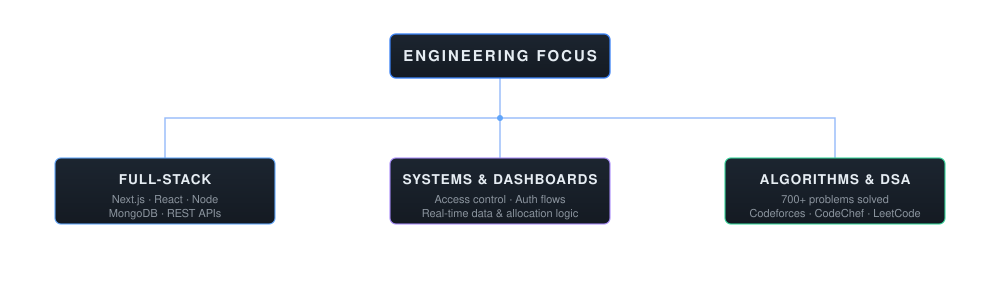

<picture>
  <source media="(prefers-color-scheme: dark)" srcset="assets/hero-dark.svg">
  <source media="(prefers-color-scheme: light)" srcset="assets/hero-light.svg">
  
</picture>

 

<picture>
  <source media="(prefers-color-scheme: dark)" srcset="https://capsule-render.vercel.app/api?type=rect&color=0:0a0e14,100:161b22&height=60&section=header&text=ABOUT&fontSize=22&fontColor=e6edf3&fontAlignY=60&desc=false">
  
</picture>

I'm a Computer Science undergraduate at **NIT Jamshedpur** (CGPA 9.17), building full-stack platforms that sit closer to real systems than to toy apps — role-based access control, allocation algorithms, audit trails, real-time dashboards. My stack of choice is **Next.js, TypeScript, Node.js and MongoDB**, and most of what I ship ends up solving a scheduling, access-control, or data-visibility problem rather than being a plain CRUD app.

Outside of shipping, I compete in **DSA and competitive programming** (700+ problems solved across Codeforces, CodeChef, LeetCode and HackerRank) and work on my institute's **official Web Team**, building and maintaining production platforms used by the campus.

 

<picture>
  <source media="(prefers-color-scheme: dark)" srcset="https://capsule-render.vercel.app/api?type=rect&color=0:0a0e14,100:161b22&height=60&section=header&text=PROFILE%20HIGHLIGHTS&fontSize=22&fontColor=e6edf3&fontAlignY=60&desc=false">
  
</picture>

<table>
<tr>
<td width="20%" align="center">🎓 <b>Education</b></td>
<td>B.Tech CSE, National Institute of Technology Jamshedpur — CGPA <b>9.17</b> (Aug 2024 – Present)</td>
</tr>
<tr>
<td align="center">💻 <b>Engineering</b></td>
<td>Official Web Team member at NIT Jamshedpur, building production platforms for the institute</td>
</tr>
<tr>
<td align="center">🚀 <b>Projects</b></td>
<td>Hackathon-winning dashboards and full-stack platforms, shipped and deployed live</td>
</tr>
<tr>
<td align="center">🏆 <b>Achievements</b></td>
<td>Hack de Science '26 Winner · Codefest '25 Rank 1/70+ teams · JEE Mains AIR 8786</td>
</tr>
<tr>
<td align="center">⚡ <b>Competitive Programming</b></td>
<td>700+ problems solved · Codeforces Pupil · CodeChef 2-Star</td>
</tr>
</table>

 

<picture>
  <source media="(prefers-color-scheme: dark)" srcset="https://capsule-render.vercel.app/api?type=rect&color=0:0a0e14,100:161b22&height=60&section=header&text=EXPERIENCE&fontSize=22&fontColor=e6edf3&fontAlignY=60&desc=false">
  
</picture>

<table>
<tr>
<td width="26%" valign="top">
<b>Official Web Team</b> 
NIT Jamshedpur 
Feb 2026 – Present
</td>
<td valign="top">
Selected through a multi-stage process — online assessment, hackathon, and technical interview. Contributing to the development and management of the institute's official website and digital platforms, including <b>E-Malkhana</b>, a digital evidence management system for case registration, evidence tracking, and chain-of-custody management.
</td>
</tr>
<tr>
<td width="26%" valign="top">
<b>OJASS '26</b> 
NIT Jamshedpur — Web Team 
Oct 2025 – Feb 2026
</td>
<td valign="top">
Contributed to the official platform for <b>East India's 2nd largest Techno-Management Fest</b>. Built responsive UI components and optimized page rendering for consistent performance across devices.
</td>
</tr>
</table>

 

<picture>
  <source media="(prefers-color-scheme: dark)" srcset="https://capsule-render.vercel.app/api?type=rect&color=0:0a0e14,100:161b22&height=60&section=header&text=TECH%20STACK&fontSize=22&fontColor=e6edf3&fontAlignY=60&desc=false">
  
</picture>

**Languages**
 

**Frontend**
 

**Backend & APIs**
 

**Database**
 

**CS Fundamentals**
 
`DSA` · `OOP` · `DBMS` · `Operating Systems` · `Computer Networks`

**Tools**
 

 

<picture>
  <source media="(prefers-color-scheme: dark)" srcset="https://capsule-render.vercel.app/api?type=rect&color=0:0a0e14,100:161b22&height=60&section=header&text=FEATURED%20PROJECTS&fontSize=22&fontColor=e6edf3&fontAlignY=60&desc=false">
  
</picture>

### 🛡️ Operation Sentinel — 🏆 Hack de Science '26 Winner

Police deployment dashboard demonstrating **weighted resource-allocation algorithms and real-time system simulation**: personnel are distributed across zones using a proportional force-allocation model built on weighted threat and zone-size scores, with incident simulation that triggers real-time troop redistribution and a heatmap-based admin view for zone-wise risk analysis.

`Next.js` `TypeScript` `MongoDB` `Tailwind CSS`

[**Source Code**](https://github.com/usrjsr/modisarkar-hackathon) · [**Live Demo**](https://modisarkar-hackathon.vercel.app/)

---

### 🕰️ MemoryLane

Full-stack digital time-capsule platform demonstrating **scheduled data unlocking, access control, and third-party AI integration** — memories stay locked until a future date, with the Gemini API layered in for AI-based content summarization and NextAuth handling multi-provider authentication.

`Next.js` `MongoDB` `Gemini API` `Tailwind CSS` `UploadThing`

[**Source Code**](https://github.com/usrjsr/memorylane) · [**Live Demo**](https://memorylane-steel.vercel.app)

---

### 🗂️ E-Malkhana

Digital evidence management system for the Jharkhand Police, demonstrating **role-based access control and chain-of-custody logging** — case registration and property tracking run behind JWT-authenticated, role-gated API routes, with QR-based evidence tagging, Cloudinary-backed media storage, and admin workflows covering the full evidence lifecycle (return, destroy, auction, court transfer).

`Next.js` `MongoDB` `NextAuth.js` `Tailwind CSS` `Cloudinary`

[**Source Code**](https://github.com/usrjsr/e-malkhana_jharkhand) · [**Live Demo**](https://e-malkhana-five.vercel.app/)

 

<picture>
  <source media="(prefers-color-scheme: dark)" srcset="https://capsule-render.vercel.app/api?type=rect&color=0:0a0e14,100:161b22&height=60&section=header&text=ENGINEERING%20FOCUS&fontSize=22&fontColor=e6edf3&fontAlignY=60&desc=false">
  
</picture>

<picture>
  <source media="(prefers-color-scheme: dark)" srcset="assets/interests-dark.svg">
  <source media="(prefers-color-scheme: light)" srcset="assets/interests-light.svg">
  
</picture>

 

<picture>
  <source media="(prefers-color-scheme: dark)" srcset="https://capsule-render.vercel.app/api?type=rect&color=0:0a0e14,100:161b22&height=60&section=header&text=COMPETITIVE%20PROGRAMMING&fontSize=22&fontColor=e6edf3&fontAlignY=60&desc=false">
  
</picture>

**700+ problems solved** across Codeforces, CodeChef, LeetCode, and HackerRank.

<table>
<tr>
<th>Platform</th>
<th>Rating</th>
<th>Profile</th>
</tr>
<tr>
<td>Codeforces</td>
<td>Pupil · Max 1272</td>
<td><a href="https://codeforces.com/profile/usrjsr">codeforces.com/profile/usrjsr</a></td>
</tr>
<tr>
<td>CodeChef</td>
<td>2★ · Max 1440</td>
<td><a href="https://www.codechef.com/users/usr_jsr">codechef.com/users/usr_jsr</a></td>
</tr>
<tr>
<td>LeetCode</td>
<td>Max 1765</td>
<td><a href="https://leetcode.com/u/usrjsr/">leetcode.com/u/usrjsr</a></td>
</tr>
</table>

 

<picture>
  <source media="(prefers-color-scheme: dark)" srcset="https://capsule-render.vercel.app/api?type=rect&color=0:0a0e14,100:161b22&height=60&section=header&text=ACHIEVEMENTS&fontSize=22&fontColor=e6edf3&fontAlignY=60&desc=false">
  
</picture>

- 🏆 **Hack de Science '26** — Winner, for the police deployment &amp; dynamic force-redistribution dashboard
- 🥇 **Codefest '25** — Rank 1 out of 70+ teams
- 🎯 **Hacksphere '25 (PCON)** — Top 7 in the competitive web hackathon
- 🥈 **Codefest '24** — Rank 6 (First-Year category), Rank 28 overall
- 📈 **JEE Mains 2024** — 99.459 percentile, AIR 8786

 

<picture>
  <source media="(prefers-color-scheme: dark)" srcset="https://capsule-render.vercel.app/api?type=rect&color=0:0a0e14,100:161b22&height=60&section=header&text=GITHUB%20ANALYTICS&fontSize=22&fontColor=e6edf3&fontAlignY=60&desc=false">
  
</picture>

 

  

 

<picture>
  <source media="(prefers-color-scheme: dark)" srcset="https://capsule-render.vercel.app/api?type=rect&color=0:0a0e14,100:161b22&height=60&section=header&text=CURRENTLY&fontSize=22&fontColor=e6edf3&fontAlignY=60&desc=false">
  
</picture>

- 🔭 **Building** — official platforms for NIT Jamshedpur as part of the institute's Web Team
- 🧠 **Exploring** — AI integration in full-stack apps (Gemini API in MemoryLane)
- ⚡ **Sharpening** — DSA and competitive programming fundamentals

 

<picture>
  <source media="(prefers-color-scheme: dark)" srcset="https://capsule-render.vercel.app/api?type=rect&color=0:0a0e14,100:161b22&height=60&section=header&text=CONNECT%20WITH%20ME&fontSize=22&fontColor=e6edf3&fontAlignY=60&desc=false">
  
</picture>

 

Built with Next.js, MongoDB, and a proportional-allocation algorithm — same as everything else here.

